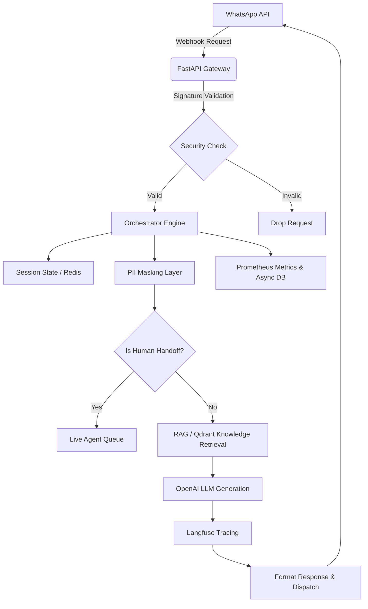

<div align="center">
  
  <h1>WhatsApp Intelligent Support Bot</h1>
  <p>
    <b>Highly Scalable, Context-Aware, Human-in-the-Loop Customer Support Engine</b>
  </p>
  
  [](https://python.org)
  [](https://fastapi.tiangolo.com)
  [](https://openai.com)
  [](https://docker.com)
  [](https://langfuse.com)
  [](https://qdrant.tech)
</div>

---

## 🌟 Executive Summary

Customer support scaling on WhatsApp can quickly become unmanageable without robust automation. **WhatsApp Support Bot** is an enterprise-grade scaffolding that intelligently triages user requests, utilizes LLM-driven knowledge retrieval (RAG), and seamlessly hands off unresolvable queries to human agents.

It is built with a strictly asynchronous architecture to handle high throughput with minimal resource overhead, ensuring sub-second latencies and strict data privacy.

---

## 🚀 Key Features

| Feature | Description | Stack |
|:---|:---|:---|
| 🧠 **Intelligent Triage** | Intent recognition and natural language processing. | `OpenAI` `LangChain` |
| 📚 **RAG Pipeline** | Semantic search across company knowledge bases. | `Qdrant` `Embeddings` |
| 🛡️ **Privacy-First** | Zero-trust PII masking (names, cards, emails) before LLM exposure. | `Presidio` / `Regex` |
| 🤝 **Human Handoff** | Context-aware escalation to live human agents. | `Redis` `Orchestrator` |
| 📊 **Deep Analytics** | Complete traceability, conversation logs, and monitoring. | `Prometheus` `SQLite` |
| 🐳 **Docker Native** | Out-of-the-box containerization for instant deployment. | `Docker Compose` |

---

## 🏗️ Architecture & Flow Diagram

The application leverages a heavily modular design. Webhooks are consumed safely, contextualized against previous state in Redis, analyzed for intent, masked, processed, and responded to.



---

## 📂 Codebase Structure

The codebase adheres strictly to Domain-Driven Design (DDD), ensuring modular isolation:

```text
whatsapp-support-bot/
├── pyproject.toml         # Python Dependencies (uv/pip)
├── Dockerfile             # Container definition for the API
├── docker-compose.yml     # Local multi-service orchestration
├── docs/                  # Extended documentation (DEPLOYMENT.md)
├── scripts/               # Utility scripts (e.g., seed_knowledge_base.py)
├── src/
│   ├── analytics/         # SQLite async DB, telemetry mapping
│   ├── api/               # FastAPI setup, route declarations
│   ├── bot/               # Redis Session management
│   ├── handoff/           # CCaaS integrations and ticketing logic
│   ├── intelligence/      # LLM processing, semantic search, Langfuse tracking
│   ├── orchestrator/      # Triage engine, failure fallbacks, safety triggers
│   └── utils/             # Helpers: PII masking, cryptographic validation, logging
└── tests/                 # Unit & Integration Testing Suite (Pytest)
```

---

## ⚙️ Getting Started (Local Development)

### Prerequisites
- Python 3.11+
- [Docker](https://docs.docker.com/get-docker/) & Docker Compose
- Accounts: WhatsApp Business API, OpenAI, Qdrant, Langfuse

### 1. Installation

Clone the repository and install dependencies:
```bash
git clone https://github.com/avuzmal/whatsapp-support-bot.git
cd whatsapp-support-bot
pip install -e .[dev]
```

### 2. Environment Setup
Copy the `.env.example` to `.env` (or configure manually) with the required values such as `WHATSAPP_VERIFY_TOKEN`, `OPENAI_API_KEY`, and database URLs.

### 3. Spin Up Infrastructure
Easily spin up the entire stack using Docker Compose:
```bash
docker compose up -d --build
```
This will launch:
* FastAPI Server (`localhost:8000`)
* Redis (`localhost:6379`)
* Qdrant (`localhost:6333`)
* PostgreSQL (if configured)

### 4. Seeding Knowledge
Populate the RAG system with default information:
```bash
python scripts/seed_knowledge_base.py
```

---

## 🧪 Testing & Quality Assurance

We maintain a rigorous standard of code quality through a comprehensive test suite.
Run tests locally using `pytest`:

```bash
# Execute unit and integration tests
pytest tests/ -v

# Run with coverage report
pytest tests/ --cov=src
```
*Current coverage validates core fallbacks, orchestrator degradation gracefully, PII masking, payload validation, and docker health endpoints.*

---

## 🚀 Deployment

We provide an infrastructure-agnostic deployment protocol. 
For production deployment, see our comprehensive **[Production Deployment Guide](./docs/DEPLOYMENT.md)**.

Highlights include:
- `infra/docker-compose.prod.yml` for multi-stage cloud deploys.
- `.github/workflows/ci.yml` for Automated CI/CD.
- Container-native resource isolation without running as root.

---

## 🛣️ Roadmap

- [x] **Phase 1**: Webhook scaffolding, robust core architecture, and fundamental pipelines.
- [ ] **Phase 2**: Full RAG pipeline deployment and advanced LLM chain reasoning (Pending).
- [ ] **Phase 3**: Custom Dashboard integrations and comprehensive analytics UI (Upcoming).

> *Note: This project is maintained independently. All future phase development is managed directly by the principal author.*